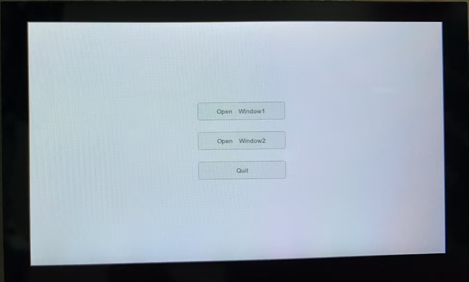

# awtk-esp 

[AWTK](https://github.com/zlgopen/awtk) 基于 [esp](https://docs.espressif.com/projects/esp-idf/zh_CN/stable/esp32/get-started/windows-setup.html#) 的移植。



> 测试硬件平台为 [ESP32-S3-Touch-LCD-4.3](https://www.waveshare.net/wiki/ESP32-S3-Touch-LCD-4.3)，其它平台请根据实际平台自行调整。

## 安装下载工具

* 建议下载离线版本 [ESP IDF v5.3.2](https://dl.espressif.com/dl/esp-idf/?idf=4.4)

## 下载代码

```
git clone https://github.com/zlgopen/awtk-esp.git
cd awtk-esp
git clone https://github.com/zlgopen/awtk.git components/awtk/awtk
git clone https://github.com/zlgopen/awtk-demo-app main/app
```

## 修改分区表

> 默认文件位置为 C://Espressif/frameworks/esp-idf-v5.3.2/components/partition_table/partitions_singleapp.csv

```csv
# Name,   Type, SubType, Offset,  Size, Flags
# Note: if you have increased the bootloader size, make sure to update the offsets to avoid overlap
nvs,      data, nvs,     ,        0x6000,
phy_init, data, phy,     ,        0x1000,
factory,  app,  factory, ,        6M,
```

## 设置目标设备类型

> 在 ESP-IDF 5.3 PowerShell 中，进入 awtk-esp 所在目录。

```
idf.py set-target esp32s3
```

## 编译

> 在 ESP-IDF 5.3 PowerShell 中，进入 awtk-esp 所在目录。

```
idf.py build
```

## 下载

用 USB 将开发板连接到电脑，让执行下面的命令

```
idf.py flash
```

## 查看调试信息

```
idf.py monitor
```

## 已知问题

* 触摸屏事件有些问题，按住不动时，不断上报 down/up 事件，不知是不是我的板子的问题。